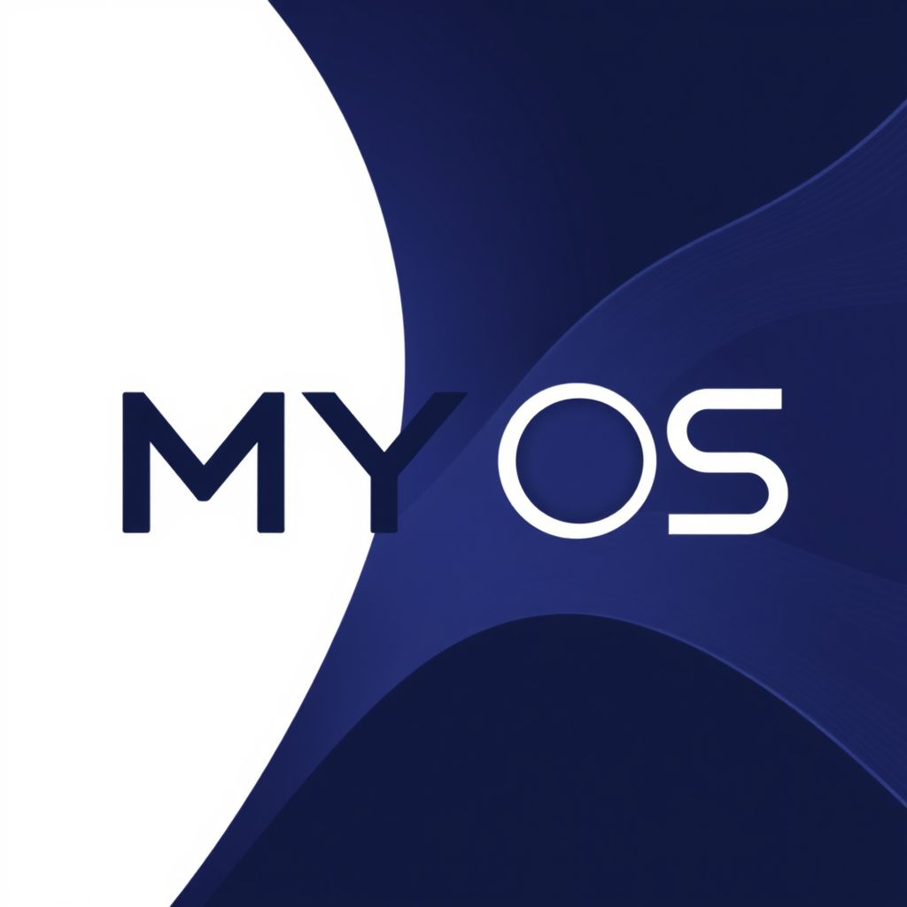

# My OS



这是一个基于 Python 开发的简单操作系统模拟器，提供了基本的系统功能和用户界面。该系统模拟了真实操作系统的核心功能，包括文件系统等功能。

## 功能特点

### 用户系统

- 多用户支持
- 用户登录界面
- 密码加密存储
- 用户权限管理

### 系统功能

- 文件管理系统
- 系统安全机制

### 用户界面

- 命令行界面
- 交互式操作
- 用户友好的提示信息

## 系统要求

### 硬件要求

- CPU: 1GHz 或更高
- 内存: 至少 100MB 可用内存
- 硬盘空间: 至少 50MB 可用空间

### 软件要求

- Python 3.6 或更高版本  （开发时：Python 3.10 + Python 3.11）
- Windows 7及更高版本或 Linux 操作系统  （开发时：Windows10 X64 + Windows11 X64）

## 使用方法

1. 在项目根目录下运行：

   ```bash
   python run.py
   ```
2. 程序会自动检查并安装所需依赖
3. 启动后，您将看到登录界面：

   - 选择用户账号(默认default_user)
   - 输入密码（默认123456）
   - 登录成功后即可使用系统功能

## 系统架构

### 目录结构

```
my-os/
├── os/                   # 操作系统核心代码
│   ├── mos/              # 系统核心模块
│   ├── steer/            # 用户引导模块
│   └── fonts/            # 系统字体文件
├── home/                 # 用户目录
│   └── program-files/    # 系统程序文件
├── run.py                # 主程序入口
└── requirements.txt      # 项目依赖
```

### 核心模块说明

- `mos/`: 包含系统核心功能实现
- `steer/`: 负责用户引导和登录管理
- `fonts/`: 存储系统使用的字体文件
- `home/`: 用户数据和程序存储目录

## 依赖包

- cryptography==42.0.5   # 用于密码加密
- art==6.1               # 用于ASCII艺术显示
- pygame==2.5.2          # 用于图形界面（V1.5）
- psutil==5.9.8          # 用于系统资源监控
- keyboard==0.13.5       # 用于键盘输入处理

## 安全特性

- 用户密码加密存储
- 系统密钥管理
- 安全的用户认证机制

## 注意事项

- 首次运行时会自动安装所需依赖
- 如遇到问题，请检查：
  - Python 版本是否符合要求
  - 依赖包是否安装成功
  - 系统权限是否足够(一般不需要额外权限)

## 开发计划

- [ ] 添加更多系统工具
- [ ] 优化用户界面
- [ ] 增加网络功能
- [ ] 添加更多安全特性

## 许可证

本项目采用 MIT 许可证

MIT License

Copyright (c) 2025 huluobuo

Permission is hereby granted, free of charge, to any person obtaining a copy
of this software and associated documentation files (the "Software"), to deal
in the Software without restriction, including without limitation the rights
to use, copy, modify, merge, publish, distribute, sublicense, and/or sell
copies of the Software, and to permit persons to whom the Software is
furnished to do so, subject to the following conditions:

The above copyright notice and this permission notice shall be included in all
copies or substantial portions of the Software.

THE SOFTWARE IS PROVIDED "AS IS", WITHOUT WARRANTY OF ANY KIND, EXPRESS OR
IMPLIED, INCLUDING BUT NOT LIMITED TO THE WARRANTIES OF MERCHANTABILITY,
FITNESS FOR A PARTICULAR PURPOSE AND NONINFRINGEMENT. IN NO EVENT SHALL THE
AUTHORS OR COPYRIGHT HOLDERS BE LIABLE FOR ANY CLAIM, DAMAGES OR OTHER
LIABILITY, WHETHER IN AN ACTION OF CONTRACT, TORT OR OTHERWISE, ARISING FROM,
OUT OF OR IN CONNECTION WITH THE SOFTWARE OR THE USE OR OTHER DEALINGS IN THE
SOFTWARE.
